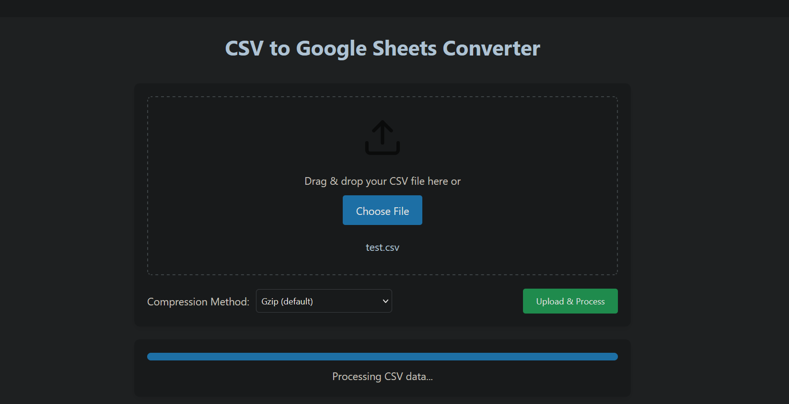
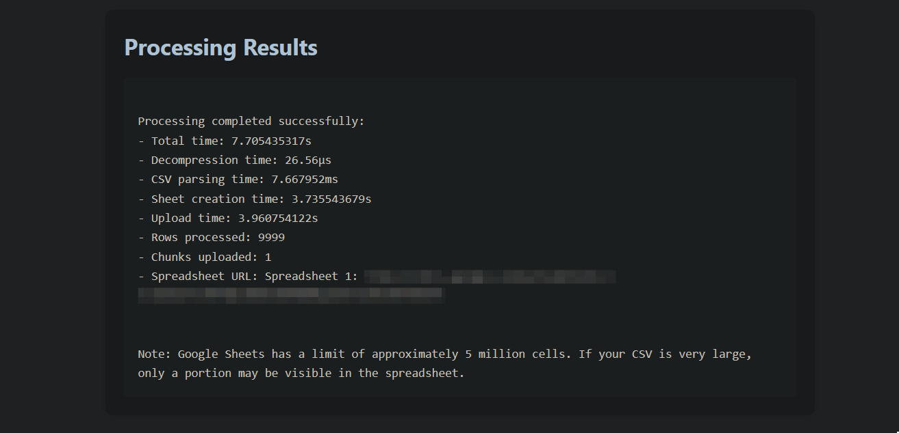
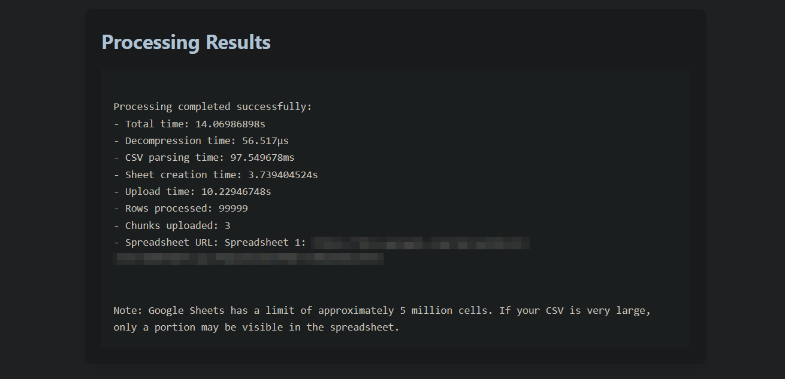
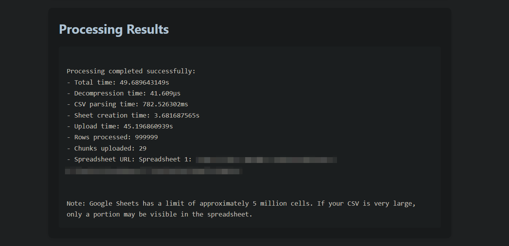

## CSV to Google Sheets

> A high performance CSV uploader that processes large datasets and uploads them to Google Sheets' Spreadsheet very fast.

## Features
- Scalability: Handles large CSVs (1 million rows in <1 min). Utilizes exponential backoff retry algorithm for large dataset volumes to avoid exceeding API rate limits.

- Efficiency: Concurrent requests with goroutines to speed up uploads.

- Reliability: Ensures no data loss through chunked uploads and in depth logging.

- Usability: Simple CLI logging and web-based dashboard for managing uploads.

## Prerequisites

- Golang v1.23+
- Python 3.12+
- `uv` package manager
- Google Cloud account with Sheets and Drive API enabled.
- Service account with API credentials JSON file

## Usage

1. Clone the repository. Run the web server (optional).

```bash
git clone https://github.com/SourasishBasu/csv2gsheets.git
cd csv2gsheets/web
uv run app.py
```

2. Create a GCP Service Account and download the `credentials.json` file for the account's keys into the root folder.

3. Open a new terminal and run the go program.

```bash
cd ../
mkdir temp
go mod tidy
go run main.go
```

Access the web UI at `localhost:8000`.



> [!NOTE]  
> The FastAPI web server is optional and is provided for convenience. Postman, Curl or any other API tooling can be used as well to send requests to the go service running at `localhost:8080`.

### Benchmarks

| Size     | Rows      | Time(seconds) | Results                      |
| -------- | --------- | ------------- | ---------------------------- |
| 4 KB     | 10000     | 7 secs        |         |
| 5 MB     | 1,00,000  | 14 secs       |         |
| 53 MB    | 10,00,000 | 49 secs       |        |

Testing performed on a 4 vCPU, 8GB RAM server on DigitalOcean using a spreadsheet of 8 columns.

### Roadmap

- [ ] Add a task queue to handle parallel csv uploads

